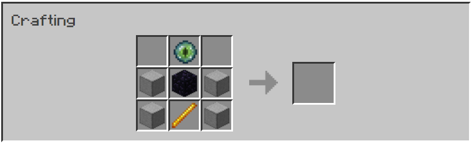

## Checkpoint

Allows players to teleport over long distances through "paired" checkpoints. Inspired by
the Waystones mod, but more tailored to Survival mode.

*NOTE: Currently only works for version 1.15.2.*

### Crafting recipes

For a checkpoint:

For a pairer:

### How it works

**Checkpoints** are structures that can be used to teleport from one place to another. They work in pairs - you
teleport between one and the other.

To **pair** two checkpoints, place one down at the place you want to teleport from, then place another one down at your
destination. Working checkpoints are indicated by the ender eye spinning and particles generating.

You can check where your next checkpoint will be "paired" to by hovering over any checkpoints in your inventory.

Teleporting between checkpoints costs **ender pearls**, 1 for every 100 blocks (along X, Y and Z-axis). Because ender
pearls can only stack in groups of 16, the maximum range is 1600 blocks in Vanilla.

When one checkpoint in a pair breaks, the other will stop working. This is where the **pairer** comes in - right-click
a broken checkpoint in order to have it pair with the next checkpoint you set down. You can also use the pairer to
link up two existing checkpoints that don't work individually.

Checkpoints will also stop working if the other one in the pair is **obstructed** - i.e. if there are blocks at
positions adjacent to the other checkpoint. This will be indicated in the GUI.

### Issues

If you have any feature suggestions or encounter any edge-cases/bugs, [file an issue](https://github.com/hanyuone/Checkpoint).